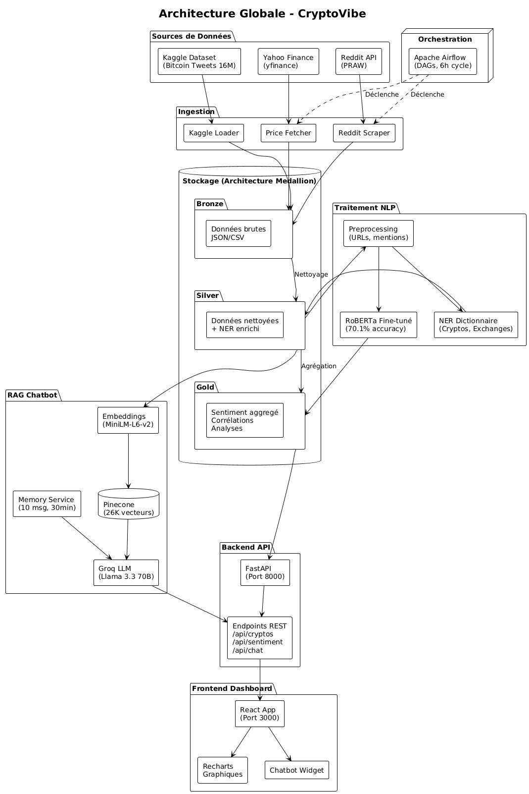
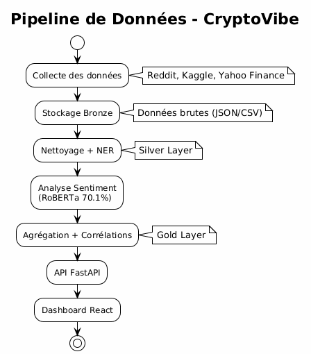
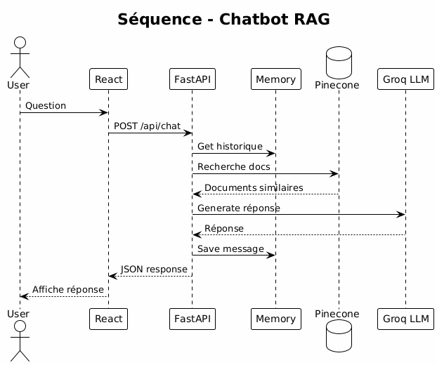
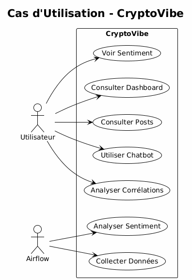
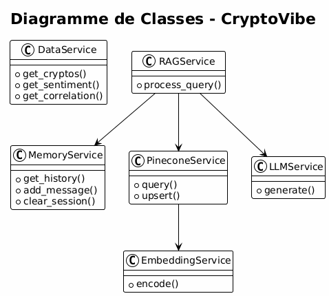
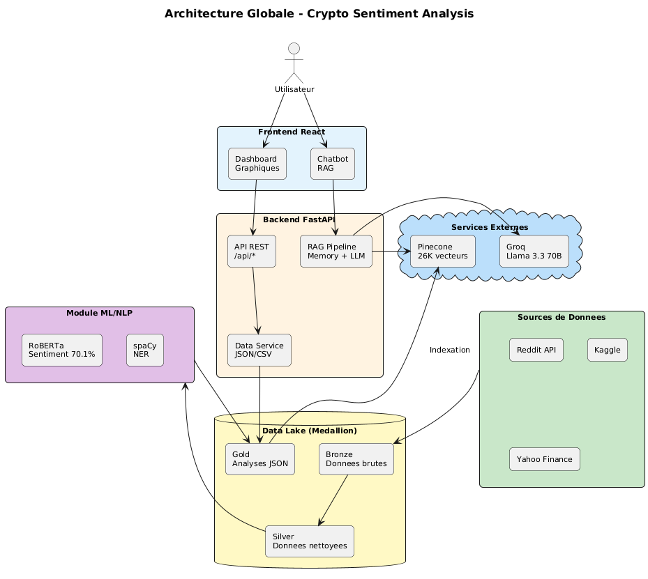
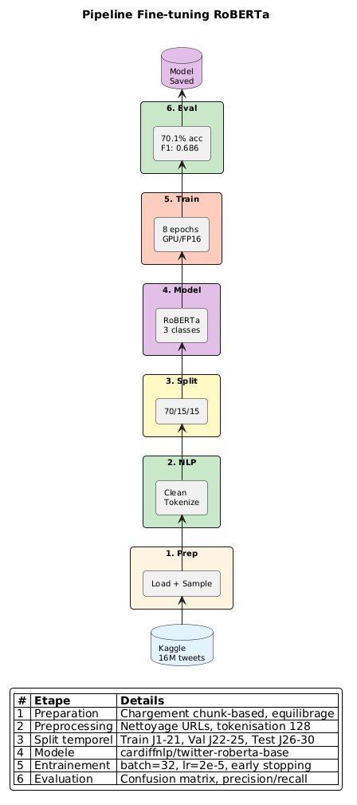
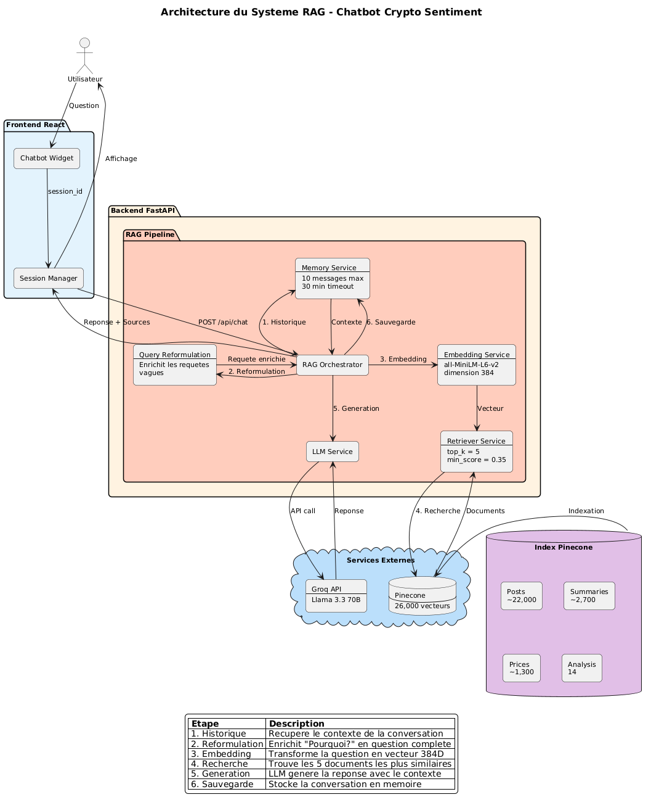

# CryptoVibe: Sentiment Analysis for Crypto Markets

[](https://www.python.org/downloads/)
[](https://reactjs.org/)
[](https://fastapi.tiangolo.com/)
[](https://opensource.org/licenses/MIT)
[](https://www.docker.com/)

CryptoVibe est une plateforme complete d'analyse de sentiment du marche des cryptomonnaies (Bitcoin, Ethereum, Solana). Elle exploite les donnees des reseaux sociaux (Twitter, Reddit), les traite via des pipelines automatises, et fournit des insights via un dashboard interactif et un chatbot RAG intelligent.

---

## Table of Contents

- [Key Features](#-key-features)
- [Architecture](#-architecture)
- [Screenshots](#-screenshots)
- [Tech Stack](#-tech-stack)
- [Installation](#-installation)
- [Usage](#-usage)
- [API Endpoints](#-api-endpoints)
- [RAG Chatbot](#-rag-chatbot)
- [VADER Sentiment Analysis](#-vader-sentiment-analysis)
- [RAGAS Evaluation](#-ragas-evaluation)
- [Project Structure](#-project-structure)
- [Testing](#-testing)
- [Team](#-team)
- [Contributing](#-contributing)
- [License](#-license)

---

## Key Features

| Feature | Description |
|---------|-------------|
| **Multi-Source Data** | Collecte depuis Reddit (PRAW), Twitter, Kaggle et Yahoo Finance |
| **Automated Pipelines** | Apache Airflow pour les workflows de traitement |
| **Hybrid Sentiment** | VADER customise + RoBERTa fine-tune pour analyse precise |
| **Market Analysis** | Correlation, lag analysis, extraction d'entites |
| **Interactive Dashboard** | Frontend React avec visualisations Recharts |
| **RAG Chatbot** | Chatbot intelligent avec memoire conversationnelle |
| **Docker Ready** | Architecture containerisee pour deploiement facile |

---

## Architecture

```
+-----------------+     +------------------+     +------------------+
|    Frontend     |     |     Backend      |     |    Data Layer    |
|    React:3000   |<--->|   FastAPI:8000   |<--->|    JSON/CSV      |
+-----------------+     +------------------+     +------------------+
                               |
                               v
                  +------------------------+
                  |      RAG Pipeline      |
                  |  +------------------+  |
                  |  | Memory Service   |  |
                  |  | (10 msg, 30min)  |  |
                  |  +------------------+  |
                  |           |            |
                  |           v            |
                  |  +------------------+  |
                  |  | Query Reformul.  |  |
                  |  +------------------+  |
                  |           |            |
                  |           v            |
                  |  +------------------+  |     +------------------+
                  |  | Embeddings       |------>|    Pinecone      |
                  |  | (MiniLM-L6-v2)   |  |     |   (~26k docs)    |
                  |  +------------------+  |     +------------------+
                  |           |            |
                  |           v            |
                  |  +------------------+  |
                  |  | LLM (Groq)       |  |
                  |  | Llama 3.3 70B    |  |
                  |  +------------------+  |
                  +------------------------+
```

### Diagrams

| Architecture Globale | Flux de Donnees | Pipeline RAG |
|:-------------------:|:---------------:|:------------:|
|  |  |  |

| Cas d'Utilisation | Diagramme de Classes | Sequence Collecte |
|:-----------------:|:-------------------:|:-----------------:|
|  |  |  |

---

## Screenshots

| Dashboard Overview | Sentiment Timeline | RAG Chatbot |
|:------------------:|:------------------:|:-----------:|
|  |  |  |

---

## Tech Stack

### Backend
| Technology | Usage |
|------------|-------|
| **FastAPI** | REST API framework |
| **Python 3.10+** | Core language |
| **Pydantic** | Data validation |
| **sentence-transformers** | Embeddings (all-MiniLM-L6-v2) |
| **Pinecone** | Vector database |
| **Groq** | LLM provider (Llama 3.3 70B) |
| **NLTK + VADER** | Sentiment analysis |

### Frontend
| Technology | Usage |
|------------|-------|
| **React 18** | UI framework |
| **React Router v6** | SPA navigation |
| **Recharts** | Data visualization |
| **Lucide React** | Icons |
| **CSS3** | Glassmorphism dark theme |

### Infrastructure
| Technology | Usage |
|------------|-------|
| **Docker** | Containerization |
| **Apache Airflow** | Pipeline orchestration |
| **GitHub Actions** | CI/CD |

---

## Installation

### Prerequisites

- Python 3.10+
- Node.js 18+
- npm 9+
- Docker & Docker Compose (optional)
- Git

### API Keys Required

| Service | Purpose | Get it from |
|---------|---------|-------------|
| Pinecone | Vector database | [pinecone.io](https://www.pinecone.io/) |
| Groq | LLM provider | [groq.com](https://groq.com/) |
| Reddit | Data scraping (optional) | [reddit.com/prefs/apps](https://www.reddit.com/prefs/apps) |

### Quick Start

```bash
# 1. Clone the repository
git clone https://github.com/kayou-s/Crypto_Analysis.git
cd Crypto_Analysis

# 2. Backend Setup
cd backend
python -m venv venv

# Windows
venv\Scripts\activate
# macOS/Linux
source venv/bin/activate

pip install -r requirements.txt

# 3. Configure environment
cp .env.example .env
# Edit .env with your API keys

# 4. Index documents for RAG
python scripts/index_documents.py --clear

# 5. Frontend Setup
cd ../dashboard
npm install
```

### Environment Variables (.env)

```bash
# Pinecone
PINECONE_API_KEY=pcsk_xxx...
PINECONE_INDEX_NAME=crypto-sentiment-rag

# LLM Provider
LLM_PROVIDER=groq
GROQ_API_KEY=gsk_xxx...

# Optional: Ollama (local)
# LLM_PROVIDER=ollama
# OLLAMA_MODEL=llama3
```

---

## Usage

### Start the Application

```bash
# Terminal 1: Backend
cd backend
uvicorn app.main:app --reload --port 8000

# Terminal 2: Frontend
cd dashboard
npm start
```

| Service | URL |
|---------|-----|
| Frontend | http://localhost:3000 |
| Backend API | http://localhost:8000 |
| API Docs | http://localhost:8000/docs |

### Docker Deployment

```bash
# Build and run all services
docker-compose up --build

# Or run individually
docker build -t cryptovibe-backend ./backend
docker run -p 8000:8000 cryptovibe-backend
```

---

## API Endpoints

### Cryptos `/api/cryptos`

| Method | Endpoint | Description |
|--------|----------|-------------|
| GET | `/api/cryptos` | Liste des cryptos + prix + variation 24h |
| GET | `/api/cryptos/{symbol}` | Details d'une crypto |
| GET | `/api/cryptos/{symbol}/chart?days=7` | Historique des prix |

### Sentiment `/api/sentiment`

| Method | Endpoint | Description |
|--------|----------|-------------|
| GET | `/api/sentiment/global` | Sentiment global du marche |
| GET | `/api/sentiment/{symbol}/timeline?days=30` | Timeline du sentiment |

### Analysis `/api/analysis`

| Method | Endpoint | Description |
|--------|----------|-------------|
| GET | `/api/analysis/{symbol}/correlation` | Correlation Pearson sentiment/prix |
| GET | `/api/analysis/{symbol}/lag` | Analyse de decalage temporel |
| GET | `/api/analysis/{symbol}/stats` | Statistiques completes |

### Events `/api/events`

| Method | Endpoint | Description |
|--------|----------|-------------|
| GET | `/api/events?crypto=BTC&limit=50` | Posts et evenements |
| GET | `/api/events/stats` | Statistiques des evenements |

### Chat RAG `/api/chat`

| Method | Endpoint | Description |
|--------|----------|-------------|
| POST | `/api/chat/` | Envoyer une question |
| POST | `/api/chat/clear` | Effacer l'historique de session |
| POST | `/api/chat/feedback` | Feedback utilisateur (thumbs up/down) |
| GET | `/api/chat/health` | Etat du systeme RAG |
| GET | `/api/chat/suggestions` | 6 questions suggerees aleatoires |

---

## RAG Chatbot

### Features

- **Conversational Memory**: Retient les 10 derniers messages (timeout 30 min)
- **Query Reformulation**: Enrichit automatiquement les requetes vagues
- **Multi-crypto Support**: BTC, ETH, SOL
- **Feedback System**: Thumbs up/down pour amelioration continue
- **Suggested Questions**: 6 questions aleatoires pour guider l'utilisateur

### Pipeline

```
Question --> Memory Check --> Reformulation --> Embedding --> Pinecone Search --> LLM --> Response
                |                   |                              |
                v                   v                              v
         Context from          Enriched query              Top 5 documents
         last 10 msgs          if vague                    (min score: 0.35)
```

### Query Reformulation Examples

| Original Query | Reformulated Query |
|----------------|-------------------|
| "Pourquoi?" | "Pourquoi Bitcoin a ce sentiment? Explique les raisons." |
| "Et Solana?" | "Quel est le sentiment de Solana?" |
| "Lequel?" | "Quelle crypto a le meilleur sentiment? Compare les." |
| "Comment?" | "Comment evolue Bitcoin? Explique la tendance." |

### Configuration

```python
# backend/app/rag/config.py
RAG_TOP_K = 5           # Documents retrieved
RAG_MIN_SCORE = 0.35    # Minimum similarity score
```

### Index Statistics

| Metric | Value |
|--------|-------|
| Total Documents | ~26,000 vectors |
| Dimension | 384 |
| Model | all-MiniLM-L6-v2 |
| Document Types | posts, daily_summary, analysis, price, faq, lag_analysis |

---

## VADER Sentiment Analysis

### Hybrid Approach

Le module VADER utilise une approche hybride combinant:

1. **Statistical Learning**: Scores generes automatiquement a partir de ~1M tweets
2. **Domain Knowledge**: Dictionnaire manuel de jargon crypto

### Custom Crypto Lexicon

| Statistic | Value |
|-----------|-------|
| Total Terms | ~55,000 |
| Positive Terms | HODL, moon, bullish, pump, gem... |
| Negative Terms | rekt, dump, scam, rug pull, FUD... |

### Performance Metrics

| Metric | Score |
|--------|-------|
| **Global Accuracy** | 69.80% |
| **Positive Recall** | 0.90 |
| **Negative Recall** | 0.19 |

| Class | Precision | Recall | F1-Score |
|-------|-----------|--------|----------|
| Negative | 0.42 | 0.19 | 0.26 |
| Positive | 0.74 | 0.90 | 0.81 |

### Usage

```python
import json
from nltk.sentiment.vader import SentimentIntensityAnalyzer

# Load VADER + crypto lexicon
sid = SentimentIntensityAnalyzer()
with open('vaderr/crypto_lexicon_final.json', 'r') as f:
    crypto_lexicon = json.load(f)
sid.lexicon.update(crypto_lexicon)

# Analyze
text = "Just bought the dip, extremely bullish on BTC! HODL."
scores = sid.polarity_scores(text)
print(f"Compound Score: {scores['compound']}")  # Positive
```

### Files

| File | Description |
|------|-------------|
| `vaderr/crypto_lexicon_final.json` | Pre-trained crypto lexicon |
| `vaderr/vader.ipynb` | Training notebook |
| `vaderr/train_full.csv` | Training dataset (70%) |
| `vaderr/val_full.csv` | Validation dataset (15%) |
| `vaderr/test_full.csv` | Test dataset (15%, ~148k tweets) |

---

## RAGAS Evaluation

### Metrics

| Metric | Description |
|--------|-------------|
| **Faithfulness** | Is the response faithful to retrieved documents? |
| **Answer Relevancy** | Is the response relevant to the question? |
| **Context Precision** | Are retrieved documents relevant? |

### Test Dataset

| Statistic | Value |
|-----------|-------|
| Total Questions | 26 |
| Categories | 7 (sentiment_general, comparison, correlation, temporal, detailed, vague, faq) |
| Difficulty Levels | 3 (easy, medium, hard) |

### Running Evaluation

```bash
cd backend

# Quick evaluation (heuristics, 5 samples)
python scripts/evaluate_rag.py --quick

# Full RAGAS evaluation
python scripts/evaluate_rag.py --full --samples 20

# Test single question
python scripts/evaluate_rag.py --query "Quel est le sentiment de Bitcoin?"

# By category
python scripts/evaluate_rag.py --category comparison --samples 5

# Dataset statistics
python scripts/evaluate_rag.py --stats
```

### Typical Results

```
Average Score: 0.721 (72.1%)

Question                                        | Score
------------------------------------------------|-------
Quel est le sentiment actuel de Bitcoin?        | 0.693
Compare le sentiment de Bitcoin et Ethereum     | 0.656
Y a-t-il une correlation sentiment/prix?        | 0.764
Quelle crypto a le meilleur sentiment?          | 0.775
Comment fonctionne le score de sentiment?       | 0.719
```

---

## Project Structure

```
Crypto_Analysis/
|
|-- backend/                      # FastAPI Backend
|   |-- app/
|   |   |-- main.py               # Entry point
|   |   |-- core/config.py        # Configuration
|   |   |-- api/routers/          # API endpoints
|   |   |   |-- cryptos.py
|   |   |   |-- sentiment.py
|   |   |   |-- analysis.py
|   |   |   |-- events.py
|   |   |   +-- chat.py           # RAG chatbot
|   |   |-- services/
|   |   |   +-- data_service.py
|   |   +-- rag/                  # RAG Module
|   |       |-- config.py
|   |       |-- prompts.py
|   |       |-- memory_service.py
|   |       |-- document_loader.py
|   |       |-- chunker.py
|   |       |-- embedding_service.py
|   |       |-- pinecone_service.py
|   |       |-- retriever_service.py
|   |       |-- llm_service.py
|   |       |-- rag_service.py
|   |       |-- feedback_service.py
|   |       +-- evaluation/
|   |           |-- ragas_evaluator.py
|   |           +-- test_dataset.py
|   |-- scripts/
|   |   |-- index_documents.py
|   |   +-- evaluate_rag.py
|   |-- tests/
|   +-- Dockerfile
|
|-- dashboard/                    # React Frontend
|   |-- src/
|   |   |-- App.jsx
|   |   |-- api/index.js
|   |   |-- components/
|   |   |   |-- Header.jsx
|   |   |   |-- Chatbot.jsx
|   |   |   |-- chabot.jsx        # v2 with feedback
|   |   |   +-- ...
|   |   |-- pages/
|   |   |   |-- Overview.jsx
|   |   |   |-- Timeline.jsx
|   |   |   |-- Analysis.jsx
|   |   |   |-- Events.jsx
|   |   |   +-- About.jsx
|   |   +-- assets/
|   +-- package.json
|
|-- analysis/                     # Statistical Analysis
|   |-- correlation.py
|   |-- lag_analysis.py
|   |-- entity_extraction.py
|   +-- time_serie_agregation.py
|
|-- vaderr/                       # VADER Sentiment
|   |-- vader.ipynb
|   |-- crypto_lexicon_final.json
|   +-- *.csv                     # Datasets
|
|-- data/
|   |-- bronze/                   # Raw data
|   |-- silver/                   # Enriched data
|   +-- gold/                     # Analyzed data
|
|-- diagrams/                     # UML & Architecture diagrams
|-- docs/                         # Documentation
|-- airflow/                      # Pipeline DAGs
+-- Dockerfile
```

---

## Testing

### Backend Tests

```bash
cd backend

# Run all RAG tests
bash tests/rag/run_all_tests.sh

# Individual tests
python -m pytest tests/

# Test specific module
bash tests/rag/test_embedding.sh
bash tests/rag/test_pinecone.sh
bash tests/rag/test_llm.sh
```

### Frontend Tests

```bash
cd dashboard
npm test
```

### RAG Evaluation

```bash
cd backend
python scripts/evaluate_rag.py --quick
```

---

## Team

<table>
  <tr>
    <td align="center">
      <br />
      <sub><b>HIDA Mohamed</b></sub>
    </td>
    <td align="center">
      <br />
      <sub><b>KAYOUH Salaheddine</b></sub><br />
      <sub><a href="mailto:kayouh.salaheddine@etu.uae.ac.ma">kayouh.salaheddine@etu.uae.ac.ma</a></sub>
    </td>
    <td align="center">
      <br />
      <sub><b>KHAILA Imane</b></sub><br />
      <sub><a href="mailto:imane.khaila@etu.uae.ac.ma">imane.khaila@etu.uae.ac.ma</a></sub>
    </td>
    <td align="center">
      <br />
      <sub><b>BROUKI Aya</b></sub><br />
      <sub><a href="mailto:brouki.aya@etu.uae.ac.ma">brouki.aya@etu.uae.ac.ma</a></sub>
    </td>
  </tr>
  <tr>
    <td align="center">
      <br />
      <sub><b>ELOUMNI Nora</b></sub><br />
      <sub><a href="mailto:eloumni.nora@etu.uae.ac.ma">eloumni.nora@etu.uae.ac.ma</a></sub>
    </td>
    <td align="center">
      <br />
      <sub><b>KHARFASSE Hiba</b></sub>
    </td>
    <td align="center">
      <br />
      <sub><b>OUANAD Hafsa</b></sub>
    </td>
    <td align="center">
      <br />
      <sub><b>YAHYA Zakariae</b></sub><br />
      <sub><a href="mailto:zakariae.yahya@etu.uae.ac.ma">zakariae.yahya@etu.uae.ac.ma</a></sub>
    </td>
  </tr>
</table>

---

## Contact

Pour toute question concernant le projet:

| Membre | Email |
|--------|-------|
| KAYOUH Salaheddine | [kayouh.salaheddine@etu.uae.ac.ma](mailto:kayouh.salaheddine@etu.uae.ac.ma) |
| KHAILA Imane | [imane.khaila@etu.uae.ac.ma](mailto:imane.khaila@etu.uae.ac.ma) |
| BROUKI Aya | [brouki.aya@etu.uae.ac.ma](mailto:brouki.aya@etu.uae.ac.ma) |
| ELOUMNI Nora | [eloumni.nora@etu.uae.ac.ma](mailto:eloumni.nora@etu.uae.ac.ma) |
| YAHYA Zakariae | [zakariae.yahya@etu.uae.ac.ma](mailto:zakariae.yahya@etu.uae.ac.ma) |

---

## Cryptocurrencies Supported

| Symbol | Name | Logo |
|--------|------|------|
| BTC | Bitcoin |  |
| ETH | Ethereum |  |
| SOL | Solana |  |

---

## Contributing

Contributions are welcome! Please follow these steps:

1. Fork the repository
2. Create a feature branch (`git checkout -b feature/amazing-feature`)
3. Commit your changes (`git commit -m 'Add amazing feature'`)
4. Push to the branch (`git push origin feature/amazing-feature`)
5. Open a Pull Request

### Code Style

- **Python**: Follow PEP 8
- **JavaScript**: ESLint configuration included
- **Commits**: Use conventional commits format

---

## Troubleshooting

| Problem | Solution |
|---------|----------|
| CORS Error | Verify backend is running on port 8000 |
| Pinecone Connection Error | Check `PINECONE_API_KEY` in `.env` |
| LLM Error | Check `GROQ_API_KEY` or switch to `LLM_PROVIDER=ollama` |
| Empty Search Results | Lower `RAG_MIN_SCORE` or reindex with `python scripts/index_documents.py --clear` |
| Unicode Errors (Windows) | Add `export PYTHONIOENCODING=utf-8` before commands |

---

## Documentation

| Document | Description |
|----------|-------------|
| [INSTALLATION.md](./docs/INSTALLATION.md) | Detailed installation guide |
| [ARCHITECTURE.md](./docs/ARCHITECTURE.md) | System architecture |
| [API_DOCUMENTATION.md](./docs/API_DOCUMENTATION.md) | API reference |
| [RAG_CHATBOT.md](./docs/RAG_CHATBOT.md) | RAG system details |
| [VADER_SENTIMENT.md](./docs/VADER_SENTIMENT.md) | Sentiment analysis |
| [RAGAS_EVALUATION.md](./docs/RAGAS_EVALUATION.md) | Evaluation metrics |
| [DATA_PIPELINE.md](./docs/DATA_PIPELINE.md) | Data processing |
| [FINE_TUNING.md](./docs/FINE_TUNING.md) | Model fine-tuning |

---

## License

This project is licensed under the MIT License - see the [LICENSE](LICENSE) file for details.

---

## Acknowledgments

- [FastAPI](https://fastapi.tiangolo.com/) - Modern Python web framework
- [React](https://reactjs.org/) - UI library
- [Pinecone](https://www.pinecone.io/) - Vector database
- [Groq](https://groq.com/) - LLM inference
- [Hugging Face](https://huggingface.co/) - Transformers & embeddings
- [NLTK VADER](https://www.nltk.org/) - Sentiment analysis
- [Apache Airflow](https://airflow.apache.org/) - Workflow orchestration

---

<p align="center">
  
  <br>
  <b>CryptoVibe</b> - Sentiment Analysis for Crypto Markets
  <br>
  Made with love by the CryptoVibe Team
</p>
